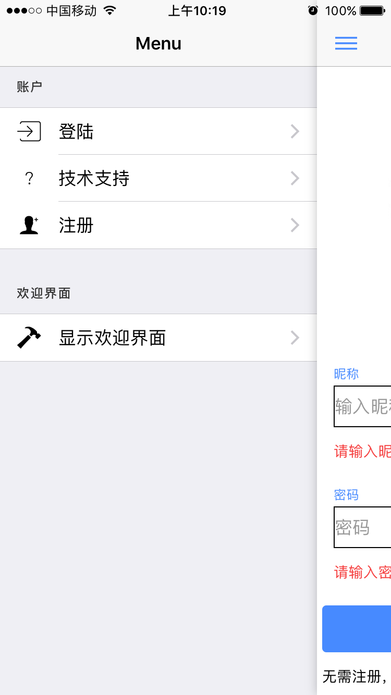
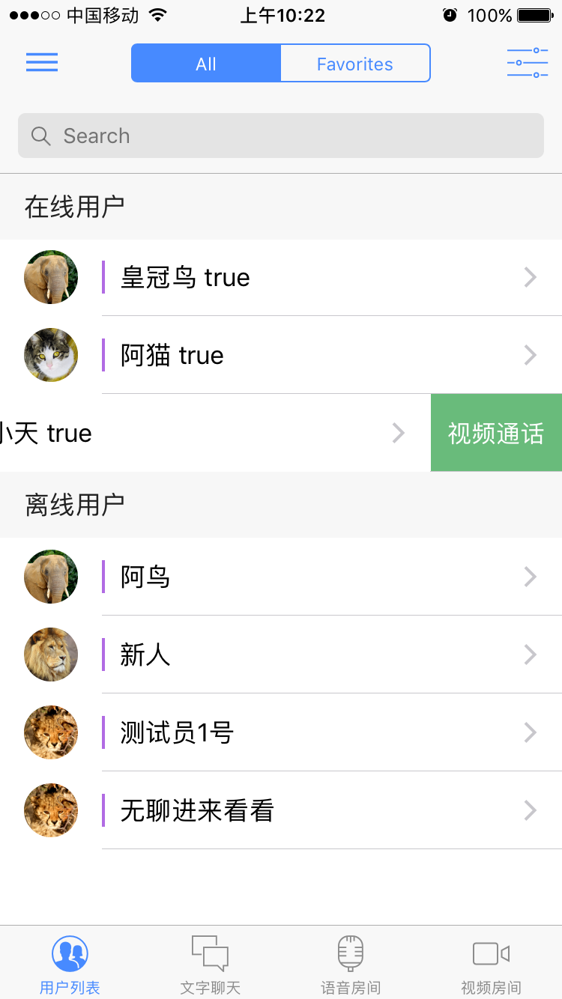
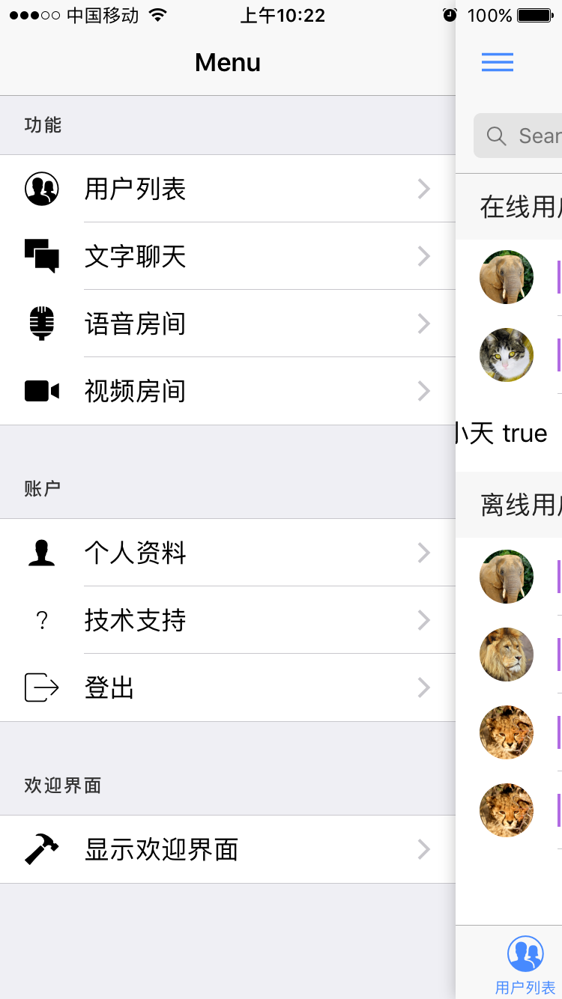
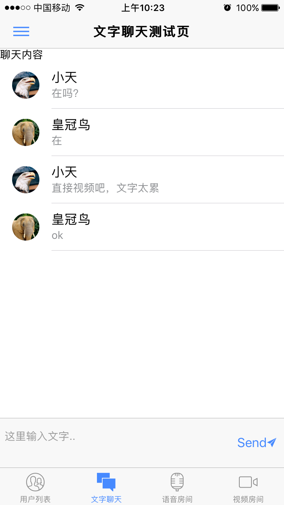
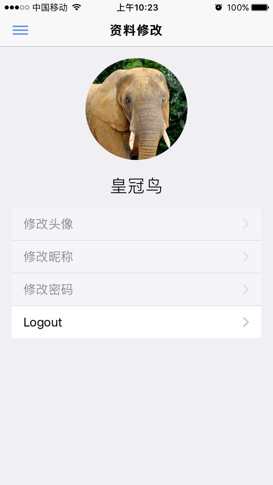
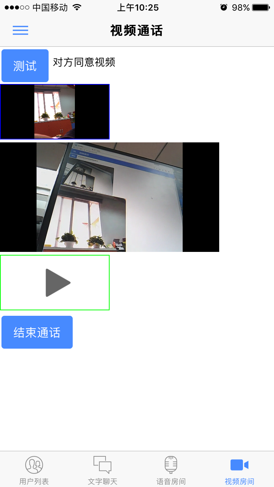

# Ionic 2 Conference Application

This is purely a demo of Ionic 2 with TypeScript. 
Login,MessageChat,VideoChat(need iceServer)
Server use node,socket.io,iceServer
git:https://github.com/xxhgnxx/server

## Table of Contents
 - [Getting Started](#getting-started)
 - [App Preview](#app-preview)
 - [File Structure of App](#file-structure-of-app)


## Getting Started
* Run `npm install` from the project root.
* Install the ionic CLI (`npm install -g ionic`)
* Run `ionic serve` in a terminal from the project root.
* Profit

**Note:** Is your build slow? Update `npm` to 3.x: `npm install -g npm`.
**Note:** If you want to use the WedioChat, you need to make a iceserver or user my server "stun:hk.airir.com".


## App Preview

  
  
  
  
  
  

## File Structure of App

```
src
│  declarations.d.ts
│  index.html
│  manifest.json
│  service-worker.js
├─app
│      app.component.ts
│      app.module.ts
│      app.template.html
│      main.ts
├─assets
│  └─img
├─pages
│  ├─about
│  │      about.html
│  │      about.scss
│  │      about.ts
│  │      
│  ├─about-popover
│  │      about-popover.ts
│  │      
│  ├─account
│  │      account.html
│  │      account.scss
│  │      account.ts
│  │      
│  ├─chat
│  │      chat.component.html
│  │      chat.component.scss
│  │      chat.component.ts
│  │      index.ts
│  │      
│  ├─login
│  │      login.html
│  │      login.scss
│  │      login.ts
│  │      
│  ├─myvedio
│  │      index.ts
│  │      myvedio.component.html
│  │      myvedio.component.scss
│  │      myvedio.component.ts
│  │      
│  ├─rtccom
│  │      index.ts
│  │      rtccom.component.html
│  │      rtccom.component.scss
│  │      rtccom.component.ts
│  │      
│  ├─schedule
│  │      schedule.html
│  │      schedule.scss
│  │      schedule.ts
│  │      
│  ├─schedule-filter
│  │      schedule-filter.html
│  │      schedule-filter.scss
│  │      schedule-filter.ts
│  │      
│  ├─session-detail
│  │      session-detail.html
│  │      session-detail.scss
│  │      session-detail.ts
│  │      
│  ├─speaker-detail
│  │      speaker-detail.html
│  │      speaker-detail.scss
│  │      speaker-detail.ts
│  │      
│  ├─speaker-list
│  │      speaker-list.html
│  │      speaker-list.scss
│  │      speaker-list.ts
│  │      
│  ├─tabs
│  │      tabs.html
│  │      tabs.scss
│  │      tabs.ts
│  │      
│  ├─voice
│  │      index.ts
│  │      voice.component.html
│  │      voice.component.scss
│  │      voice.component.ts
│  │      
│  └─webrtc
│          index.ts
│          webrtc.component.html
│          webrtc.component.scss
│          webrtc.component.ts
│          
├─providers
│      data.ts
│      datatype.ts
│      getHeadPope.ts
│      socket-server.ts
│      user-server.ts
│      user.ts
│      webrtc-server.ts
└─theme
        variables.scss     
```